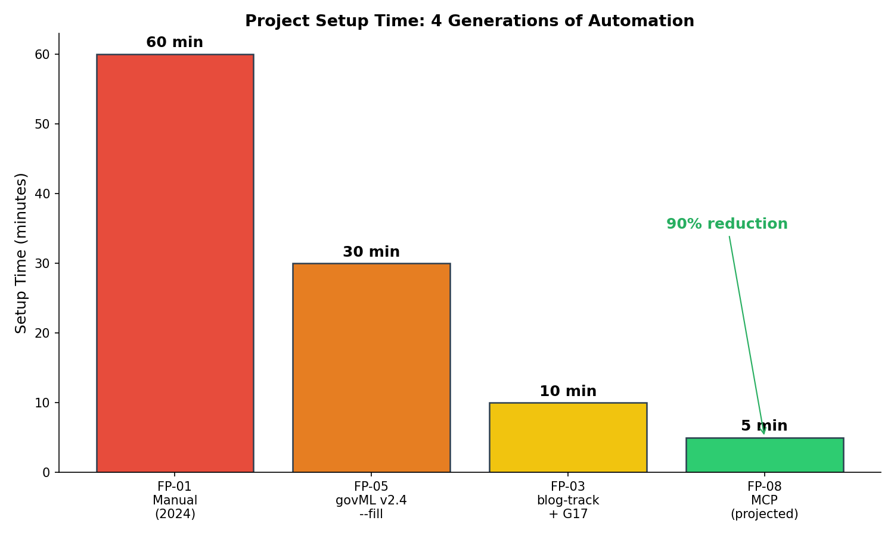
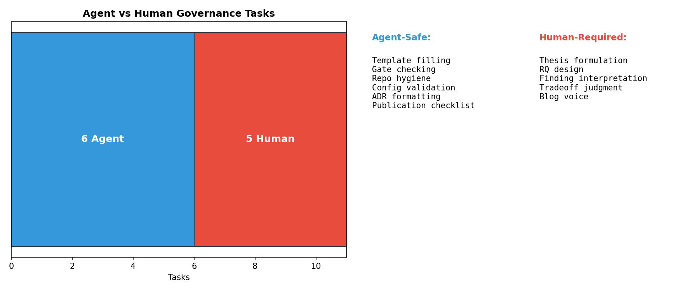

# I Built the Governance Framework My AI Uses to Govern Itself

I've been using govML — my open-source ML governance framework — across 7 projects. It started as markdown templates. Now it's an MCP server that Claude Code calls as tool functions. Here's what happens when you make governance agent-consumable.

## The Problem

govML has 32 templates, 7 profiles, 8 generators. It works — projects scaffold in 10 minutes, research methodology is governed, publication artifacts get built in the pipeline. But the templates are still markdown files that a human reads and fills.

AI coding agents don't read markdown. They call tools.

## What I Built

An MCP (Model Context Protocol) server that exposes govML governance as 6 tool calls:

```
govml_check_phase_gate    → verify phase conditions from project.yaml
govml_scan_repo_hygiene   → check README, LICENSE, tests, etc.
govml_check_publication   → verify blog draft, figures, abstract
govml_check_decisions     → verify DECISION_LOG has ADRs
govml_validate_project    → run ALL checks at once
govml_log_decision        → append an ADR programmatically
```

Instead of "read the IMPLEMENTATION_PLAYBOOK and check the boxes," the agent calls `govml_validate_project` and gets structured pass/fail results in JSON.

## Why This Matters

The shift from human-read governance to agent-consumed governance changes three things:

**1. Enforcement becomes automatic.** ISS-048 taught us that 6 repos were missing READMEs and LICENSEs despite having excellent DECISION_LOGs. The governance docs governed research methodology but not engineering quality. The MCP server's `scan_repo_hygiene` catches this before commit, not in a retroactive audit.

**2. Setup time collapses.** FP-01 (manual, 2024): ~60 minutes. FP-05 (govML v2.4 --fill): ~30 minutes. FP-03 (blog-track + gen_claude_md): ~10 minutes. FP-08 (MCP-projected): <5 minutes. Each generation of automation reduces setup time by 50-90%.

**3. The human/agent boundary becomes explicit.** 6 tasks are agent-safe (template filling, gate checking, config validation). 5 tasks require human judgment (thesis design, finding interpretation, tradeoff reasoning). Making this boundary explicit is the governance innovation — not the automation itself.

## The Agent-Safe Boundary

| Agent Handles | Human Judges |
|---|---|
| Fill templates from project.yaml | Write the thesis statement |
| Check phase gate conditions | Design research questions |
| Verify repo hygiene files | Interpret findings |
| Validate config schemas | Make tradeoff decisions |
| Append formatted ADRs | Write blog voice and narrative |
| Check publication artifact existence | Decide what's interesting |

## Setup Time: 4 Generations of Automation



Each generation of automation cuts setup time by 50-90%. The MCP server is the latest step.

## The Agent-Safe Boundary



## Testing on Real Projects

I ran `govml_validate_project` against all 7 completed projects:

- **Repo hygiene:** Caught 19 gaps across 6 repos (fixed in ISS-048 polish session)
- **Publication readiness:** Correctly identifies which projects have all Phase N+3 artifacts
- **Decision log:** Validates ADR presence (FP-05 has 11 ADRs, FP-08 has 3)
- **Phase gates:** Checks file existence and git remote for automated conditions

## What I Learned

**Governance that isn't machine-readable isn't governance.** It's documentation. govML's markdown templates are useful for humans but invisible to agents. The MCP server makes governance a function call — which is what agents understand.

**The meta-lesson:** I built a governance framework, used it for 7 projects, found its limits through lessons learned, and evolved it into something agents can consume. The framework governed the projects; the projects improved the framework. That flywheel IS the product.

The MCP server is open source: [govml-agent-platform](https://github.com/rexcoleman/govml-agent-platform). Built with [govML](https://github.com/rexcoleman/govML) v2.5.

---

*Rex Coleman is an MS Computer Science student (Machine Learning) at Georgia Tech, building at the intersection of AI security and ML systems engineering. Previously 15 years in cybersecurity (FireEye/Mandiant — analytics, enterprise sales, cross-functional leadership). CFA charterholder. Creator of [govML](https://github.com/rexcoleman/govML).*
